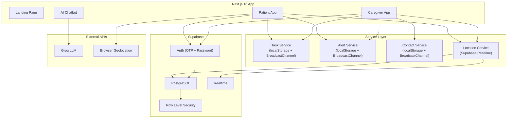

# AlzCare — Alzheimer's Patient Monitoring System

## 🏗️ Overview

**AlzCare** is a full-stack web application for monitoring and supporting Alzheimer's patients. It provides two distinct interfaces — one for **patients** and one for **caregivers** — connected via a shared backend (Supabase) and real-time sync layer.

---

## 🔧 Tech Stack

| Layer | Technology |
|---|---|
| **Framework** | Next.js 16 (App Router) |
| **Language** | TypeScript |
| **Styling** | TailwindCSS 4 + `@tailwindcss/postcss` |
| **Backend/DB** | [Supabase](https://supabase.com) (PostgreSQL + Auth + Realtime) |
| **Auth** | Supabase Auth (OTP for patients, password for caregivers) |
| **Maps** | Leaflet + React-Leaflet + Google Maps API |
| **Charts** | Recharts |
| **Animations** | Framer Motion |
| **Icons** | Lucide React |
| **AI Chat** | Groq SDK (LLM-powered chatbot) |
| **Font** | Inter (Google Fonts via `next/font`) |

---

## 📁 Project Structure

```
d:\alzcare1111\
├── app/                        # Next.js App Router pages
│   ├── layout.tsx              # Root layout (AuthProvider wraps all routes)
│   ├── page.tsx                # Landing / login page (~40KB, feature-rich)
│   ├── globals.css             # Global styles
│   ├── (auth)/                 # Auth route group
│   │   ├── login/              # Login page
│   │   ├── login-notification/ # Post-login notification
│   │   └── register/           # Registration page
│   ├── api/
│   │   └── chat/route.ts       # AI chatbot API (Groq SDK)
│   ├── caregiver/              # Caregiver dashboard interface
│   │   ├── layout.tsx          # Sidebar navigation layout
│   │   ├── dashboard/          # Main dashboard
│   │   ├── activities/         # Patient activity tracking
│   │   ├── alerts/             # Alert management
│   │   ├── health/             # Health status monitoring
│   │   ├── location/           # GPS location tracking
│   │   ├── patients/           # Patient management
│   │   ├── reminders/          # Reminder management
│   │   ├── settings/           # Caregiver settings
│   │   └── welcome/            # Onboarding/welcome
│   └── patient/                # Patient dashboard interface
│       ├── layout.tsx          # Sidebar navigation layout
│       ├── dashboard/          # Main patient home
│       ├── activities/         # Activity log
│       ├── alerts/             # SOS & alerts
│       ├── caregiver/          # View linked caregivers
│       ├── location/           # Location sharing
│       ├── reminders/          # Medication reminders
│       ├── settings/           # Patient settings
│       └── welcome/            # Patient onboarding
├── components/
│   ├── AnimatedBackground.tsx  # Particle/animated background
│   ├── LoginFeaturePanel.tsx   # Login page feature showcase
│   ├── ParticleCanvas.tsx      # Canvas-based particle effects
│   ├── caregiver/              # Caregiver-specific components
│   │   ├── PatientLocationCard.tsx  # Patient location card
│   │   └── PatientMap.tsx           # Map component
│   └── patient/                # Patient-specific components
│       ├── AIChatbot.tsx       # AI assistant chatbot (~19KB)
│       └── LocationStatus.tsx  # Location tracking status
├── context/
│   └── AuthContext.tsx         # Auth state management (~690 lines)
├── hooks/
│   ├── useCaregiverLocation.ts # Caregiver-side location polling
│   ├── useLocationTracker.ts   # Patient GPS tracking (watchPosition)
│   └── useVoiceRecorder.tsx    # Voice note recording + playback
├── lib/                        # Service layer
│   ├── supabase.ts             # Supabase client (singleton browser client)
│   ├── supabase-server.ts      # Server-side Supabase client
│   ├── task-service.ts         # Task/reminder CRUD + real-time sync
│   ├── alert-service.ts        # Alert/SOS system + real-time sync
│   ├── contact-service.ts      # Contact links + live location + calls
│   └── location-service.ts     # GPS location persistence (Supabase DB)
├── types/
│   └── index.ts                # TypeScript interfaces & types
└── proxy.ts                    # Middleware (auth guards + role-based routing)
```

---

## 👥 User Roles

```typescript
type UserRole = 'patient' | 'caregiver_primary' | 'caregiver_secondary';
```

| Role | Description |
|---|---|
| `patient` | Alzheimer's patient — simplified UI, OTP login, GPS tracked |
| `caregiver_primary` | Primary caregiver — full CRUD permissions, password login |
| `caregiver_secondary` | Secondary caregiver — limited permissions (view-only for some features) |

---

## 🔐 Authentication Architecture

### Two Distinct Auth Flows

#### Patient (OTP-based)
1. Patient enters email → `sendOTP()` sends a Supabase magic link/OTP
2. Patient enters 6-digit code → `verifyOTP()` validates
3. On first login (registration), profile is created with `role: 'patient'`
4. On subsequent logins, existing profile is fetched by email

#### Caregiver (Password-based)
1. Caregiver registers with email + password → `signUpCaregiver()`
2. Profile created with `role: caregiver_primary | caregiver_secondary`
3. During registration, caregiver can link to a patient by email
4. Login via `signInCaregiver()` with password, optional 2FA via `verify2FA()`

### Security Features
- **Account locking**: 3 failed attempts → 15-minute lockout
- **Session timeout**: 30 minutes of inactivity → auto logout
- **Activity tracking**: Mouse, keyboard, touch, scroll events reset timer
- **Login notifications**: Email sent on each successful login
- **Remember email**: Optional localStorage persistence
- **Profile ID healing**: Auto-fixes auth ID mismatches (Supabase ID vs profile ID)

---

## 📊 Data Models

### Core Entities (Supabase Tables)

| Table | Key Fields | Purpose |
|---|---|---|
| `profiles` | id, email, name, role, phone, 2FA fields, lock fields | User accounts |
| `patient_caregiver_links` | patient_id, caregiver_id, relationship, permissions | Role-based linking |
| `locations` | patient_id, lat, lng, accuracy, timestamp | GPS tracking history |
| `medications` | patient_id, name, dosage, schedule, taken_logs | Medication tracking |
| `tasks` | patient_id, title, steps, scheduled_time, completed | Daily task management |
| `alerts` | patient_id, caregiver_id, type, priority, location | SOS & system alerts |
| `notes` | patient_id, author_id, content | Caregiver notes |
| `wellness_logs` | caregiver_id, stress_level, sleep_hours | Caregiver wellness |

### Permission Model

```typescript
interface CaregiverPermissions {
  view_meds: boolean;
  edit_meds: boolean;
  view_location: boolean;
  edit_notes: boolean;
  view_tasks: boolean;
  edit_tasks: boolean;
  trigger_sos: boolean;
}
```

Primary caregivers get full permissions; secondary caregivers get view-only + SOS trigger.

---

## ⚡ Real-Time Sync Architecture

The project uses a **hybrid real-time strategy**:

### 1. localStorage + BroadcastChannel (Tasks, Alerts, Contacts)
Used by [task-service.ts](file:///d:/alzcare1111/lib/task-service.ts), [alert-service.ts](file:///d:/alzcare1111/lib/alert-service.ts), and [contact-service.ts](file:///d:/alzcare1111/lib/contact-service.ts):

```
Write → localStorage.setItem()
       → CustomEvent (same-tab)
       → BroadcastChannel (cross-tab)
       → StorageEvent (cross-tab fallback)
       → visibilitychange (catch-up on tab focus)
```

This enables **instant cross-tab sync** between patient and caregiver windows without network round-trips.

### 2. Supabase Realtime (Location)
Used by [location-service.ts](file:///d:/alzcare1111/lib/location-service.ts):

```
Patient GPS → saveLocation() → Supabase INSERT
                                     ↓
Caregiver ← subscribeToLocationUpdates() ← postgres_changes (INSERT)
```

GPS data is persisted to Supabase and streamed to caregivers via Postgres Realtime subscriptions.

---

## 🗺️ Key Features

### Patient Side
| Feature | Route | Description |
|---|---|---|
| Dashboard | `/patient/dashboard` | Daily overview, tasks, medications |
| Activities | `/patient/activities` | Activity log & history |
| Reminders | `/patient/reminders` | Medication & task reminders |
| Alerts/SOS | `/patient/alerts` | Emergency SOS button, mood reporting |
| Caregiver View | `/patient/caregiver` | See linked caregivers, contact info |
| Location | `/patient/location` | GPS tracking status, share location |
| AI Chatbot | Component | LLM-powered assistant (Groq API) |
| Voice Notes | Hook | Record & send voice messages to caregiver |
| Settings | `/patient/settings` | Profile, language, accessibility |

### Caregiver Side
| Feature | Route | Description |
|---|---|---|
| Dashboard | `/caregiver/dashboard` | Multi-patient overview, stats |
| Patient Activity | `/caregiver/activities` | Monitor patient activities |
| Reminders | `/caregiver/reminders` | Create/manage patient reminders |
| Alerts | `/caregiver/alerts` | Receive SOS alerts, notifications |
| Patients | `/caregiver/patients` | Manage linked patients |
| Location | `/caregiver/location` | Real-time patient GPS map |
| Health Status | `/caregiver/health` | Health metrics & wellness |
| Settings | `/caregiver/settings` | Account, notifications, preferences |

---

## 🛡️ Middleware & Route Protection

[proxy.ts](file:///d:/alzcare1111/proxy.ts) implements role-based route guards:

```
Public routes: /, /login, /register, /forgot-password, /about
Patient routes: /patient/* → requires role=patient
Caregiver routes: /caregiver/* → requires role=caregiver_*

Cross-role access → redirect to appropriate dashboard
No session → redirect to /login
No profile → redirect to /register
Locked account → redirect to /login with error
```

---

## 🎨 Design System

- **Theme**: Dark mode (`bg-[#020617]`) with emerald accent palette
- **Glass effects**: `backdrop-blur-xl`, semi-transparent backgrounds
- **Sidebar**: Collapsible navigation with icon-only mode
- **Animations**: Framer Motion for transitions, particle canvas background
- **Typography**: Inter font family
- **Responsive**: Mobile-aware layouts with collapsible sidebar

---

## 🔑 Environment Variables

```env
NEXT_PUBLIC_SUPABASE_URL=<supabase-project-url>
NEXT_PUBLIC_SUPABASE_ANON_KEY=<supabase-anon-key>
```

> [!NOTE]
> The Groq API key for the AI chatbot is likely configured in the chat API route or as an additional env variable.

---

## 📌 Architecture Diagram



---

## ⚠️ Known Patterns & Gotchas

1. **Profile ID Healing**: The auth context includes logic to fix mismatches between Supabase auth user IDs and profile table IDs (can happen with OTP re-registration)
2. **Hybrid Storage**: Tasks/alerts use localStorage (fast, offline-capable) while locations use Supabase (persistent, multi-device)
3. **Stale Session Cleanup**: On app load, if a session exists but no matching profile is found, the session is automatically cleaned up
4. **Commented-out Code**: OTP resend functionality and server-side Supabase client code are commented out but preserved for future implementation
